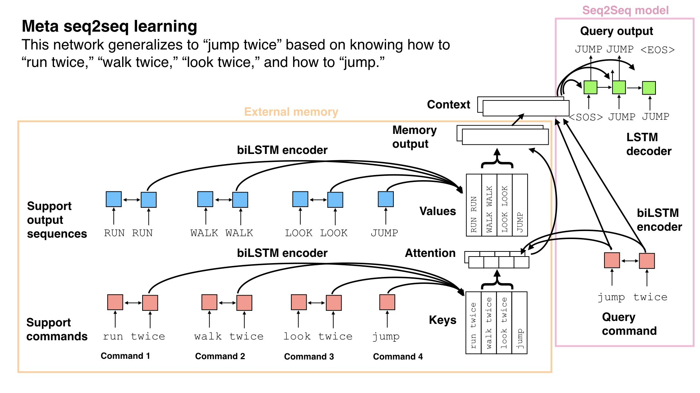

# PyTorch implementation of Meta Sequence-to-Sequence Learning

Meta seq2seq learning is a form of memory-based meta-learning for seq2seq models. Vanilla neural nets struggle with compositionality, but they can be improved through training on a series of seq2seq problems to acquire the compositional skills needed for solving new problems. 



### License

Please see the LICENSE for terms of use.

### Citing this code
Please cite the following paper:

[Lake, B. M. (2019). Compositional generalization through meta sequence-to-sequence learning.](https://cims.nyu.edu/~brenden/papers/Lake2019NeurIPS.pdf) Advances in Neural Information Processing Systems.

I am grateful to Sean Robertson for his [seq2seq tutorial](https://github.com/spro/practical-pytorch/blob/master/seq2seq-translation/seq2seq-translation-batched.ipynb) which was the basis of the seq2seq code.

### Pre-requisites 
Python 3   
numpy   
PyTorch (developed on v1.0)

### Using the code

**Training a model**   
To run the model with default parameters from the NeurIPS paper, trained on the Mutual Exclusivity task, you can simply type:
```python
python train.py
```
which will produce a file `out_models/net_ME.tar`.

Every 100 epochs the training script will print the time remaining as well as validation performance:
```python
TrainLoss: 0.0017, ValAccRetrieval: 100.0, ValAccGeneralize: 100.0
```
Validation performance is based on held-out episodes, and split between retrieval and generalization accuracy. The measure `ValAccRetrieval` is for queries that are identical to support examples, and thus it simply evaluates retrieval from memory and not generalization. The measure `ValAccGeneralize` evaluates novel queries. Examples are correct only if the entire output sequence is correct.

Use the `-h` option to view arguments:
```
optional arguments:
  -h, --help            show this help message and exit
  --num_episodes NUM_EPISODES
                        number of episodes for training
  --lr LR               ADAM learning rate
  --lr_decay_schedule LR_DECAY_SCHEDULE
                        decrease learning rate by 1e-1 after this many
                        episodes
  --nlayers NLAYERS     number of layers in the LSTM
  --max_length_eval MAX_LENGTH_EVAL
                        maximum generated sequence length when evaluating the
                        network
  --emb_size EMB_SIZE   size of sequence embedding (also, nhidden for encoder
                        and decoder LSTMs)
  --dropout DROPOUT     dropout applied to embeddings and LSTMs
  --fn_out_model FN_OUT_MODEL
                        filename for saving the model
  --dir_model DIR_MODEL
                        directory for saving model files
  --episode_type EPISODE_TYPE
                        what type of episodes do we want
  --disable_memory      Disable external memory, ignore support set, and use
                        simple RNN encoder
  --disable_attention   Disable the decoder attention
  --disable_recon_loss  Disable reconstruction loss, where support items are
                        included also as query items
  --gpu GPU             set which GPU we want to use
```  

The important argument ``--episode_type`` determines which experiment to run and can take the following values:
* `ME` : NeurIPS Exp 1; Mutual exclusivity
* `scan_prim_permutation` : NeurIPS Exp 2; SCAN task; Adding a new primitive through permutation meta-training 
* `scan_prim_augmentation` : NeurIPS Exp 3; SCAN task; Adding a new primitive through augmentation meta-training
* `scan_around_right` : NeurIPS Exp 4; SCAN task; Combining familiar concepts through meta-training
* `scan_length` : NeurIPS Exp 5; SCAN task; Generalizing to longer instructions through meta-training

**Testing a model**   
Models trained on SCAN are evaluated using the `test.py` script

After running, say,
```
python train.py --episode_type scan_prim_permutation
```
which produces a file `out_models/net_scan_prim_permutation.tar`

Run the test script
```
python test.py --episode_type scan_prim_permutation --fn_in_model net_scan_prim_permutation.tar --dir_model out_models
```
to evaluate the model on the SCAN task as described in the paper, where the SCAN split is determined by the type of episode it was trained on.

The `test.py` script has arguments: 
```
optional arguments:
  -h, --help            show this help message and exit
  --fn_in_model FN_IN_MODEL
                        filename for saved model we want to load
  --dir_model DIR_MODEL
                        directory of saved model file
  --episode_type EPISODE_TYPE
```